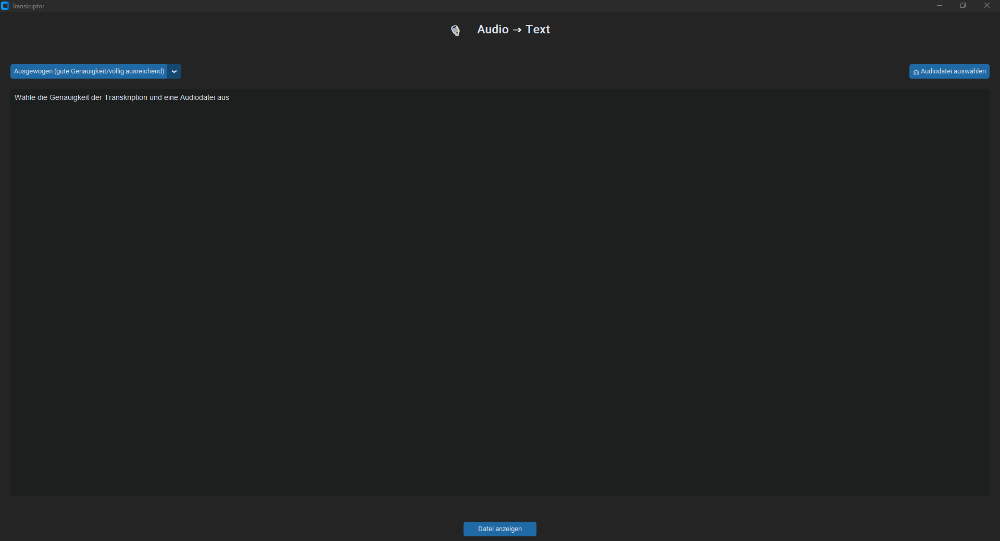

# 🎙️ Transkriptor – Audio zu Text mit Whisper + GUI

**Transkriptor** ist ein einfaches, elegantes Python-Tool mit moderner Benutzeroberfläche (CustomTkinter), das es dir ermöglicht, Audioaufnahmen schnell und präzise in Text umzuwandeln. Im Hintergrund arbeitet das leistungsstarke [OpenAI Whisper](https://github.com/openai/whisper)-Modell.

---

## 🔧 Features

- ✅ Moderne und benutzerfreundliche GUI (dunkler Modus)
- 🎧 Unterstützt MP3, WAV, M4A
- ⚙️ Auswahl verschiedener Modelle (schnell → sehr genau)
- 🧠 Nutzt OpenAI Whisper zur Spracherkennung
- 📂 Automatische Speicherung der Transkripte im `output`-Ordner mit Zeitstempel
- ✂️ Automatische Text-Formatierung mit sinnvollen Umbrüchen

---

## 🖼️ Vorschau

---

## 🚀 Installation

Alle benötigten Bibliotheken sind in der requirements.txt zu finden.
Diese müssen installiert sein, um die ANwendung starten zu können.
Exe-Release folgt